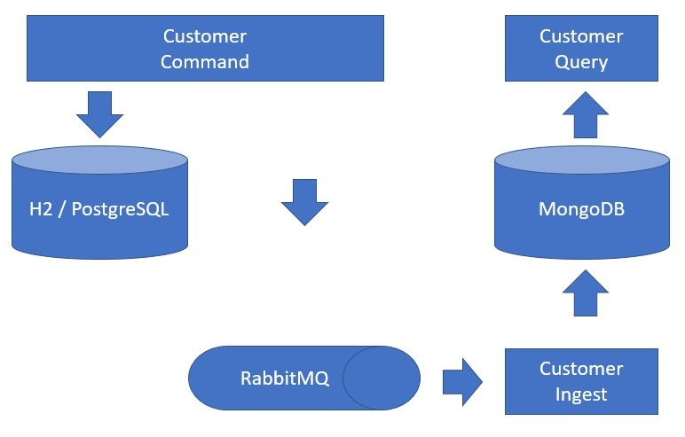

# spring-boot-interview

Projeto referente ao [Teste](https://github.com/gustavodallanora/spring-boot-interview).

### Features

* Cadastrar cidade
* Cadastrar cliente
* Consultar cidade pelo nome
* Consultar cidade pelo estado
* Consultar cliente pelo nome
* Consultar cliente pelo Id
* Remover cliente
* Alterar o nome do cliente

### Getting Started

Executar o projeto através do comando

```
$ mvn spring-boot:run
```
Este comando deverá executar o projeto localmente: http://localhost:8080

***APIs:*** As informações referentes as APIs podem ser acessadas através da página do swagger: http://localhost:8080/swagger-ui.html

### Testes

```
$ mvn test
```

### build

Executar o comando:

```
$ mvn clean package
```

em seguida, executar a aplicação:

```
# para ambientes de produção
java -jar -Dspring.profiles.active=prod target/app-0.0.1-SNAPSHOT.jar

# Para ambiente de desenvolvimento, executar o comando sem o parametro "spring.profiles.active"
```

### Licença

[GPLv3](https://tldrlegal.com/license/gnu-general-public-license-v3-(gpl-3))

### Ambientes

Executar os seguintes ambientes:

**RabbitMQ:**
```
docker run --name amq -p 15672:15672 -p 5672:5672 -d rabbitmq:3.8.9-management-alpine
```

**MongoDB:**
```
 docker run --name mongodb -p 27017:27017 -d mongo:4.0.20-xenial
```

### Arquitetura



